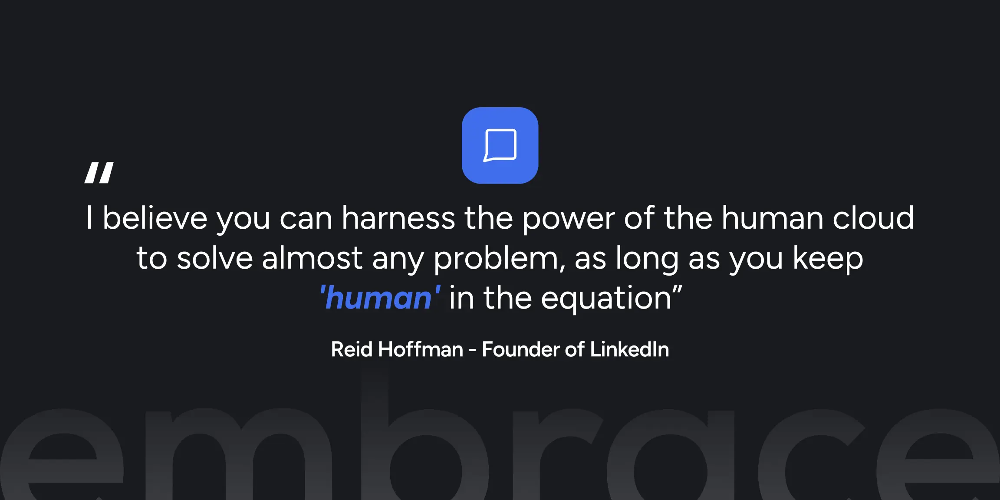

# Propositie

 <figure><figcaption></figcaption></figure>

Door de digitale revolutie is de schaal, snelheid en complexiteit van de wereld om ons heen exponentieel gegroeid. De digitale superhelden van dit tijdperk hebben in korte tijd de verwachtingen van mensen op het gebied van service en dienstverlening krankzinnig hoog gelegd.

Embrace helpt organisaties om dit tempo bij te benen en de verwachtingen van hun klanten en medewerkers waar te blijven maken. Onze software automatiseert en digitaliseert processen en kennis, en doorbreekt daarmee barrières die vaak onbewust zijn opgeworpen: processen die in de weg staan in plaats van helpen, werk dat ons niet eens echt nodig heeft en technische barrières die voorkomen dat iedereen mee kan doen.

Anderzijds geloven wij dat juist in dit digitale tijdperk mensen het verschil maken en door het samenbrengen van de juiste mensen magie ontstaat die jou en je klanten écht kan helpen. Daarom gebruiken wij de kracht van menselijke interactie voor uitwisseling van relevante kennis, het bedenken van creatieve ideeën en het vinden van vernuftige oplossingen.

En zo creëren we een ruimte waar mensen door slimme automatisering, krachtige tools en ruimte voor menselijke interactie uiteindelijk zichzelf kunnen helpen. Dat is The Human Cloud.
