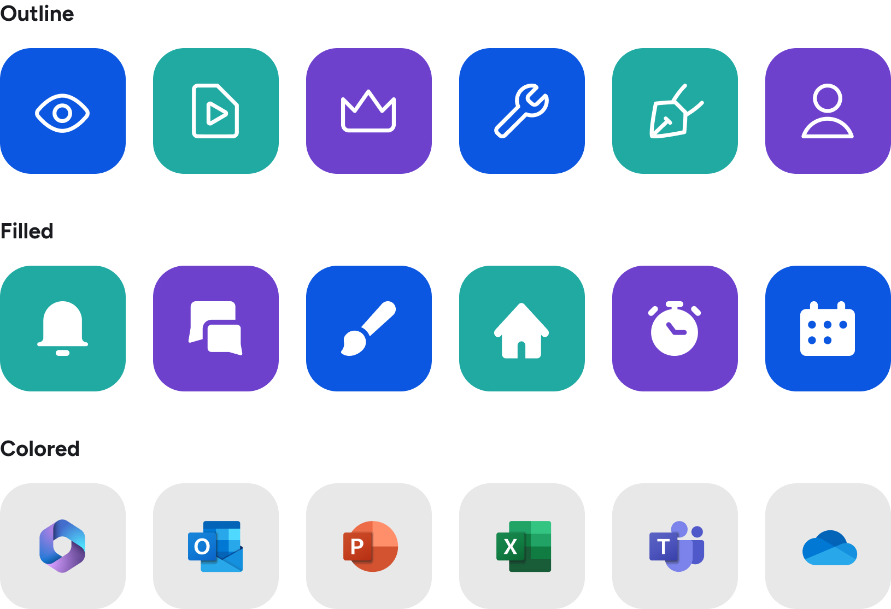

# Iconen

Iconen zijn grafische symbolen die informatie snel en effectief overbrengen. Ze zijn cruciaal in gebruikersinterfaces en branding door hun visuele aantrekkingskracht en functionaliteit. Deze minimalistische iconenset sluit perfect aan bij de merkidentiteit van Embrace met specifieke kleuren, vormen en stijlen, wat merkherkenning en loyaliteit versterkt.

Iconen kunnen complexe ideeën of acties op een eenvoudige en duidelijke manier communiceren. Ze overstijgen taalbarrières en kunnen universeel worden begrepen, waardoor ze bijzonder nuttig zijn in mondiale toepassingen.

Iconen kunnen ook helpen om inhoud toegankelijker te maken. Voor gebruikers met leesproblemen of mensen die verschillende talen spreken, bieden iconen een alternatieve manier om de inhoud te begrijpen. Dit iconenset geeft een minimalistisch en tijdloos effect waardoor ze voor een zeer lange tijd gebruikt kunnen worden. Wij hanteren 3 verschillende varianten van iconen voor zowel onze software als marketing uitingen.

<figure><figcaption></figcaption></figure>

### **Product iconen**

> Ons product heeft zijn eigen iconset, gebaseerd op Google's Material Design Icons. Deze willen we zo consistent mogelijk gebruiken, zowel in het product als in onze marketing communicatie.&#x20;


Embrace Icons v2.1


In ons product gebruiken we een iconfont - deze is te vinden via [https://dev.azure.com/embrace/Embrace%20Suite/\_git/design-iconfont](https://dev.azure.com/embrace/Embrace%20Suite/_git/design-iconfont)

### Voorbeelden

<figure><figcaption></figcaption></figure>

