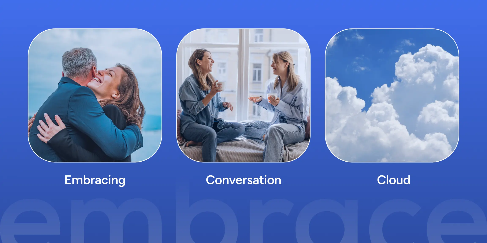
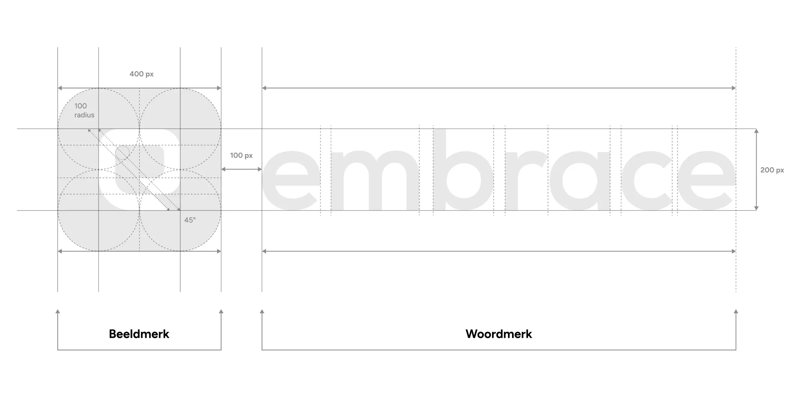
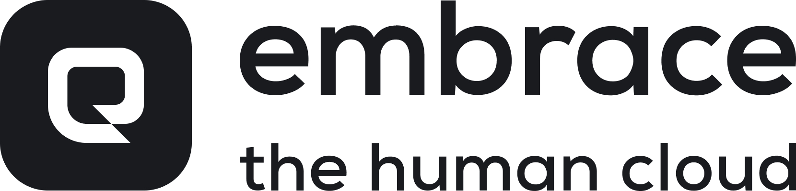
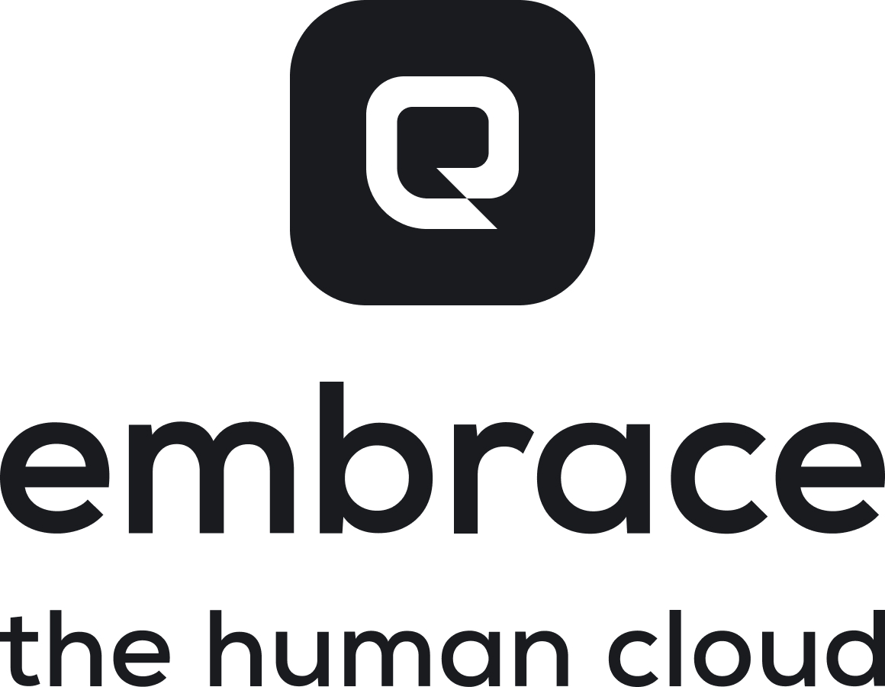

# Logo


Primary & secondary logo


### Waarop is het logo gebaseerd?

## **Toepassing**

Het logo is een herkenningspunt voor onze klanten en heeft daarom meestal een contextrol. In de informatiehierarchie zal het logo daarom alleen als eerste komen als de herkenning direct nodig is voor bevestiging van de afzender (zoals bij de website).

### Logo grid

<figure><figcaption></figcaption></figure>

### Primary logo

Het primaire logo is het meest representatieve symbool van Embrace. Dit logo bevat zowel het beeldmerk als het woordmerk. Het wordt consequent gebruikt op diverse platforms, waaronder de website, marketingmaterialen en productverpakkingen. Hierdoor wordt het alomtegenwoordige imago van Embrace uitgedrukt, wat directe herkenning van het bedrijf bevordert.

<figure><figcaption></figcaption></figure>

### Secundaire logo met pay-off horizontaal

Alternatieve varianten van het logo bevatten zowel het beeldmerk, woordmerk of beide maar is simpel gezegd een andere versie van het logo. Het secundaire logo zorgt er voor dat er consistentie plaats kan vinden wanneer het primaire logo niet gebruikt kan worden. Het op de juiste manier gebruiken van een secundair logo helpt de merkcoherentie te behouden en biedt tegelijkertijd flexibiliteit voor verschillende toepassingen en contexten.

<figure><figcaption></figcaption></figure>

### Secundaire logo met pay-off verticaal&#x20;

De pay-off “The Human Cloud” wordt gebruikt om het doel van het merk “Embrace” te verduidelijken, de memorabiliteit te vergroten, om ons te onderscheiden van de concurrentie, om de boodschap te versterken, een emotionele band te creëren met onze doelgroep of een verandering te communiceren.

<figure><figcaption></figcaption></figure>

### Beeldmerk

Minimaal logo voor gebruik als voetnoot of in kleine ruimtes

### Logo's op achtergrond

<figure><figcaption></figcaption></figure>

<figure><figcaption></figcaption></figure>

<figure><figcaption></figcaption></figure>

### Dont's&#x20;

Hiernaast vindt je enkele voorbeelden die je altijd moet vermijden bij het gebruik van het logo.

<figure><figcaption></figcaption></figure>
